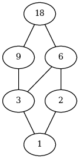
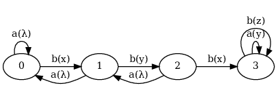
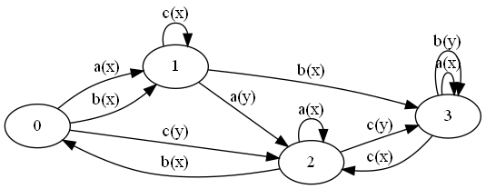
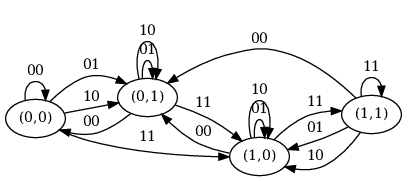
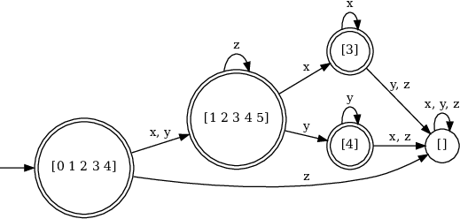

# Домашние задания по курсу «Дискретная математика»

<script src="https://polyfill.io/v3/polyfill.min.js?features=es6"></script>
<script type="text/javascript" id="MathJax-script" async="true"
  src="https://cdn.jsdelivr.net/npm/mathjax@3/es5/tex-chtml.js">
</script>

<div id="toc"></div>
<script src="toc.js"></script>
<script>
makeTOC.localizedHeader = "Содержание"
makeTOC.localizedShow = "Показать";
makeTOC.localizedHide = "Скрыть";
window.MathJax = {
  tex: {
    inlineMath: [['$', '$'], ['\\(', '\\)']]
  }
};
</script>

## Отправка домашних работ

* Домашние работы следует отправлять на ящик `avkonovalov@bmstu.ru` с ящика
  `…@student.bmstu.ru`.
* Заголовок письма должен начинаться со слова `HOMEWORK`.
* Файл присылается во вложении. Имя файла должно быть таким, которое указано
  в задании.


## 1. Программирование на языке Go
### 1.1 Быстрая сортировка (`qsort.go`, 4 балла)

Реализуйте алгоритм быстрой сортировки произвольных данных в функции

```go
func qsort(n int,
           less func(i, j int) bool,
           swap func(i, j int)) {
    ...
}
```

В качестве параметров функция `qsort` должна принимать:

* `n` — количество сортируемых записей,
* `less` — функцию сравнения $i$-той и $j$-той записи,
* `swap` — функцию обмена $i$-той и $j$-той записи.

Составьте программу `qsort.go`, демонстрирующую работоспособность функции
`qsort`.

### 1.2 Кодирование и раскодирование UTF-8 (`utf8.go`, 4 балла)

Реализуйте алгоритмы перевода текста из UTF-32 в UTF-8, и обратно.
Алгоритмы должны быть оформлены в виде двух функций:

```go
func encode(utf32 []rune) []byte {
    ...
}

func decode(utf8 []byte) []rune {
    ...
}
```


Функция `encode` принимает в качестве параметра текст в виде массива
кодовых точек и возвращает образ этого текста в UTF-8. Функция `decode`
выполняет обратное преобразование. Правила кодирования текста в UTF-8
приведены в таблице:

#### Кодирование символов Unicode в UTF-8

Код символа в Unicode      |     1     |     2     |     3     |     4
---------------------------|-----------|-----------|-----------|-----------
0 0000 0000 0000 0xxx xxxx | 0xxx xxxx |     —     |     —     |     —
0 0000 0000 0yyy yyxx xxxx | 110y yyyy | 10xx xxxx |     —     |     —
0 0000 zzzz yyyy yyxx xxxx | 1110 zzzz | 10yy yyyy | 10xx xxxx |     —
u uuzz zzzz yyyy yyxx xxxx | 1111 0uuu | 10zz zzzz | 10yy yyyy | 10xx xxxx

Составьте программу `utf8.go`, демонстрирующую работоспособность функций
`decode` и `encode`. Проверьте правильность результатов работы функций
с помощью встроенных средств Go.

### 1.3 «Длинное» сложение (`add.go`, 4 балла)

Реализуйте алгоритм сложения натуральных чисел, представленных в виде
массива цифр в системе счисления по основанию $p$, где $1<p<2^{30}$.
Порядок цифр в массиве — little-endian (младшая цифра располагается
в нулевом элементе массива).

```go
func add(a, b []int32, p int) []int32 {
    ...
}
```

Составьте программу `add.go`, демонстрирующую работоспособность функции
`add`.

### 1.4 Решение СЛАУ в рациональных числах (`gauss.go`, 4 балла)

Составьте программу `gauss.go`, выполняющую решение системы линейных
алгебраических уравнений в рациональных числах методом Гаусса.

Формат входных данных:

Программа должна считывать из входного потока число $N$ уравнений
($1\leq N\leq5$) и матрицу системы размером $N\times\left(N+1\right)$.
Матрица содержит целые числа от -9 до 9.

Формат результата работы программы:

Если система не имеет решения, следует выводить фразу «`No solution`».

Если решение существует, программа должна печатать в выходной поток
$N$ значений переменных, каждое из которых представляет собой нормализованное
рациональное число, записанное в виде $n$/$d$, где $n$ — числитель
дроби, $d$ — знаменатель дроби.

Например, если на вход программы подаётся
```
3
-4  -1   8   2
 7  -7   7   3
 5  -1  -4   7
```
то на выходе мы получаем
```
377/21
214/7
274/21
```

### 1.5 Вычисление выражений в польской записи (`polish.go`, 4 балла)

Польская запись — это форма записи арифметических, логических и алгебраических
выражений, в которой операция располагается слева от операндов. Выражения
в польской записи могут обходиться без скобок, однако мы оставим скобки
для наглядности.

Например, выражение $5\cdot(3+4)$ в польской записи выглядит как
```
(* 5 (+ 3 4))
```

Пусть в нашем случае выражения состоят из чисел от `0` до `9`, круглых
скобок и трёх знаков операций: плюс, минус и звёздочка (умножить).
Требуется составить программу `polish.go`, вычисляющую значение выражения.

### 1.6 Экономное вычисление выражений в польской записи (`econom.go`, 4 балла)

Пусть выражения в польской записи состоят из имён переменных (от `a` до `z`),
круглых скобок и трёх знаков операций: `#`, `$` и `@` (смысл операций
мы определять не будем).

Выражения могут содержать повторяющиеся подвыражения. Экономное вычисление
таких выражений подразумевает, что повторяющиеся подвыражения вычисляются
только один раз.

Требуется составить программу `econom.go`, вычисляющую количество операций,
которые нужно выполнить для экономного вычисления выражения. Примеры работы
программы приведены в таблице:

#### Набор тестов для программы экономного вычисления выражений в польской записи

Выражение                                   | Количество операций
--------------------------------------------|-------------------
`x`                                         | 0
`($xy)`                                     | 1
`($(@ab)c)`                                 | 2
`(#i($jk))`                                 | 2
`(#($ab)($ab))`                             | 2
`(@(#ab)($ab))`                             | 3
`(#($a($b($cd)))(@($b($cd))($a($b($cd)))))` | 5
`(#($(#xy)($(#ab)(#ab)))(@z($(#ab)(#ab))))` | 6

### 1.7 Лексический анализ (`lex.go`, 5 баллов)

Пусть **идентификатор** — это последовательность латинских букв
и цифр, начинающаяся с буквы.

Известно, что в некоторой строке записаны идентификаторы, разделённые
произвольным количеством пробелов. При этом строка может начинаться
и заканчиваться произвольным количеством пробелов. Назовём такую строку
**предложением**.

**Лексический анализ** предложения заключается в выделении из него
последовательности записанных в нём идентификаторов. В результате
лексического анализа получается массив целых чисел, каждое из которых
соответствует одному из идентификаторов. Целые числа назначаются идентификаторам
произвольно, но так, чтобы разным идентификаторам соответствовали
разные числа, а равным идентификаторам — одинаковые числа.

**Пример.** Пусть дано предложение

```
alpha x1 beta alpha x1 y
```

Тогда на выходе лексического анализатора может получиться последовательность
чисел
```
1 2 3 1 2 4
```
Здесь число `1` соответствует идентификатору `alpha`, число `2` — идентификатору
`x1`, число `3` — идентификатору `beta`, а число `4` — идентификатору `y`.

Необходимо разработать функцию lex, выполняющую лексический анализ
предложения:

```go
func lex(sentence string, array AssocArray) []int {
    ...
}
```

В качестве первого параметра функция `lex` принимает предложение,
а второй параметр задаёт ассоциативный массив, который должен быть использован
внутри функции для хранения соответствия идентификаторов и целых чисел.

Ассоциативный массив, который можно передавать в функцию `lex`, должен
реализовывать интерфейс `AssocArray`:

```go
type AssocArray interface {
    Assign(s string, x int)
    Lookup(s string) (x int, exists bool)
}
```

Метод `Assign` добавляет в ассоциативный массив словарную пару.

Метод `Lookup` выполняет поиск словарной пары по ключу и возвращает
два значения: `x` и `exists`. Если словарной пары с указанным ключом
в массиве нет, то `exists` принимает значение `false`. В противном случае
`exists` равен `true`, а `x` — связанное с ключом значение.

Составьте программу `lex.go`, демонстрирующую работоспособность функции
`lex`. В качестве ассоциативных массивов для тестирования функции `lex`
нужно использовать список с пропусками и АВЛ-дерево.

### 1.8 Арифметическое выражение (`arith.go`, 4 балла)

Составьте программу `arith.go`, вычисляющую значение скобочного арифметического
выражения.

Арифметическое выражение считывается из аргументов командной строки
и представляет собой строку, содержащую целые числа от 0 до $2^{31}$,
знаки четырёх арифметических операций, имена переменных, круглые скобки
и пробелы. Имена переменных представляют собой последовательности
латинских букв и цифр, начинающиеся с буквы. Арифметические операции —
целочисленные, то есть `5/2` даёт `2`, а не `2.5`. Пробелы не несут никакого
смысла и должны игнорироваться программой.

Примеры выражений, которые могут быть поданы на вход программе:

```
-x * (x+10) * (128/x-5)
Length * Height * Depth
```

Грамматика для арифметических выражений записывается как

```
<E>  ::= <E> + <T> | <E> - <T> | <T>.
<T>  ::= <T> * <F> | <T> / <F> | <F>.
<F>  ::= <number> | <var> | ( <E> ) | - <F>.
```

Здесь `number` и `var` обозначают множества
терминальных символов, соответствующих числам и именам переменных.

После удаления левой рекурсии получается LL(1)-грамматика

```
<E>  ::= <T> <E'>.
<E'> ::= + <T> <E'> | - <T> <E'> | .
<T>  ::= <F> <T'>.
<T'> ::= * <F> <T'> | / <F> <T'> | .
<F>  ::= <number> | <var> | ( <E> ) | - <F>.
```

Алгоритм вычисления значения выражения должен быть разбит на две части:
лексический анализатор и синтаксический анализатор.

Задачей лексического анализатора является разбиение арифметического
выражения на лексемы, то есть выделение в нём числовых констант, имён
переменных, знаков операций и круглых скобок. Пробелы во время лексического
анализа пропускаются. Каждая лексема представляется в виде экземпляра
структуры `Lexem`:

```go
type Lexem struct {
    Tag
    Image string
}
```


Здесь `Image` — подстрока арифметического выражения, соответствующая
распознанной лексеме, а `Tag` — целочисленный код, задающий тип лексемы:

```go
type Tag int

const (
    ERROR Tag = 1 << iota  // Неправильная лексема
    NUMBER                 // Целое число
    VAR                    // Имя переменной
    PLUS                   // Знак +
    MINUS                  // Знак -
    MUL                    // Знак *
    DIV                    // Знак /
    LPAREN                 // Левая круглая скобка
    RPAREN                 // Правая круглая скобка
)
```

Значения кодов лексем образуют степени двойки, чтобы можно было эффективно
проверять принадлежность текущей лексемы некоторому множеству лексем.
Например, если `lx` — переменная, в которой хранится текущая лексема,
то проверить, является ли она аддитивной арифметической операцией,
можно следующим образом:

```go
if lx.Tag & (PLUS | MINUS) != 0 {
    ...
}
```

Лексический анализатор должен выполняться в отдельной go-программе,
получающей на вход арифметическое выражение и канал лексем и отправляющей
распознанные лексемы в этот канал:

```go
func lexer(expr string, lexems chan Lexem) {
    ...
}
```

Синтаксический анализатор должен быть составлен методом рекурсивного
спуска по приведённой LL(1)-грамматике.

Программа должна запрашивать у пользователя значения переменных, входящих
в выражение, и выводить в стандартный поток вывода значение выражения
или сообщение «error», если выражение содержит синтаксическую
ошибку. Если некоторая переменная входит в выражение многократно,
её значение всё равно должно запрашиваться только один раз.

## 2. Алгоритмы обработки графов
### 2.1 Граф делителей (`Dividers.*`, 2 балла)

Составьте программу, выполняющую построение графа делителей натурального
числа $x$ такого, что $0<x<2^{32}$.

Вершинами графа делителей являются все делители числа $x$. Ребро
соединяет вершины $u$ и $v$ в том случае, если $u$ делится на $v$,
и не существует такого $w$, что $u$ делится на $w$, и $w$ делится
на $v$. Пример графа делителей изображён на рисунке:



Число $x$ должно считываться со стандартного потока ввода. Граф делителей,
описанный на языке DOT, должен выводиться в стандартный поток вывода.

### 2.2 Подготовка экспедиции на Марс (`Mars.*`, 2 балла)

$N$ кандидатов готовятся к двум космическим экспедициям на Марс.
Поскольку экспедиции будут продолжаться несколько лет, а их участники
окажутся в замкнутом пространстве небольшого объёма, то важное значение
приобретает психологическая совместимость членов экипажа. Путём тестирования
были установлены пары кандидатов, присутствие которых в одной и той же
экспедиции было бы нежелательным. Результаты тестирования отражены
в таблице размера $N\times N$. Если на пересечении $i$-той строки
и $j$-го столбца таблицы находится знак «+», то участие $i$-го
и $j$-го кандидатов в одной экспедиции нежелательно.

Составьте программу, разделяющую кандидатов на две группы
для участия в экспедициях. Если такое разделение невозможно, программа
должна выводить сообщение «`No solution`». В противном случае, программа
должна выводить номера кандидатов, принадлежащих первой группе. Первой
группой мы будем считать группу, в которой меньше кандидатов.

Естественно, хорошо написанная программа должна стремиться к тому,
чтобы размеры групп не очень сильно отличались. Поэтому, если возможно
несколько разбиений на группы, программа должна выбирать разбиение
с минимальной разностью количеств кандидатов в группах. При этом
в случае, если разбиений с минимальной разницей всё равно получается
несколько, для определённости выбирается разбиение, в котором первая
группа лексикографически меньше, чем первые группы остальных разбиений.

Программа должна считывать со стандартного потока ввода количество
кандидатов и матрицу размера $N\times N$. Например, для входных данных
```
8
- - + - - - - -
- - - + - - - -
+ - - - - - - +
- + - - - + - -
- - - - - - - -
- - - + - - - -
- - - - - - - +
- - + - - - + -
```
программа должна выводить
```
1 2 6 8
```

### 2.3 Наибольший компонент (`MaxComponent.*`, 2 балла)

Составьте программу, выполняющую поиск наибольшей компоненты связности
в неориентированном мультиграфе. Наибольшей считается компонента, содержащая
максимальное количество вершин. Если две или более компоненты содержат
одинаковое количество вершин, то выбирается та из них, в которой больше рёбер.
Если же и это не позволяет однозначно выбрать наибольшую компоненту,
следует предпочесть компоненту, содержащую минимальную по номеру вершину.

Программа должна считывать со стандартного потока ввода количество вершин
графа $N$ ($1 \le N \le 1000000$), количество рёбер $M$ ($0 \le M \le 1000000$)
и данные о рёбрах графа. При этом каждое ребро кодируется номерами инцидентных
ему вершин $u$ и $v$ такими, что $0 \le u,v < N$.

Программа должна формировать в стандартном потоке вывода описание графа
в формате DOT. При этом вершины графа должны быть помечены своими номерами,
и, кроме того, вершины и рёбра наибольшей компоненты должны быть раскрашены
красным цветом.

Пример входных данных:

```
7
8
0 1
0 5
1 5
1 4
5 4
2 3
3 6
```

Программа должна использовать представление графа в виде списка инцидентности.

### 2.4 Количество мостов (`BridgeNum.*`, 2 балла)

Составьте программу, определяющую количество мостов в неориентированном
простом графе.

Программа должна считывать со стандартного потока ввода количество вершин
графа $N$, количество рёбер $M$ и данные о рёбрах графа. При этом каждое ребро
кодируется номерами инцидентных ему вершин $u$ и $v$ такими, что $0\le u,v<N$.

Программа должна хранить граф в памяти в виде списков инцидентности.

### 2.5 Равноудалённые вершины (`EqDist.*`, 2 балла)

Мы будем называть **расстоянием** от вершины $u$ до вершины $v$
неориентированного простого графа минимальную длину цепи, соединяющей эти
вершины. Если расстояния от вершины $u$ до вершин $v_{1}$, $v_{2}$, $\ldots$,
$v_{k}$ равны, то мы будем говорить, что вершина $u$ равноудалена от вершин
$v_{1}$, $v_{2}$, $\ldots$, $v_{k}$.

Составьте программу, выполняющую поиск всех вершин неориентированного простого
графа, равноудалённых от вершин $v_{1}$, $v_{2}$, $\ldots$, $v_{k}$ (эти
вершины мы будем называть **опорными**).

Программа должна считывать со стандартного потока ввода количество вершин графа
$N$, количество рёбер $M$, данные о рёбрах графа, количество опорных вершин $K$
и номера опорных вершин. При этом каждое ребро кодируется номерами инцидентных
ему вершин $u$ и $v$ такими, что $0\leq u,v<N$.

В результате работы программы в стандартном потоке вывода должна находиться
отсортированная по возрастанию последовательность номеров вершин графа,
равноудалённых от опорных вершин. Если таких вершин нет, программа должна
выводить «минус».

Программа должна хранить граф в памяти в виде списков инцидентности.

### 2.6 Дорожки в парке (`Kruskal`, 2 балла)

Составьте программу, реализующую алгоритм Крускала для вычисления минимальной
суммарной длины дорожек в парке аттракционов. Дорожки должны быть проложены
таким образом, чтобы между любыми двумя аттракционами существовал маршрут.

Программа должна считывать со стандартного потока ввода количество аттракционов
и их координаты. При этом координаты каждого аттракциона задаются парой целых
чисел (в декартовой системе).

Программа должна выводить в стандартный поток вывода минимальную суммарную
длину дорожек с точностью до двух знаков после запятой.

Например, для входных данных
```
12
2 4
2 5
3 4
3 5
6 5
6 6
7 5
7 6
5 1
5 2
6 1
6 2
```
программа должна выводить число `14.83`.

### 2.7 Телефонные линии (`Prim.*`, 2 балла)

На строительном участке нужно создать телефонную сеть, соединяющую
все бытовки. Для того, чтобы телефонные линии не мешали строительству,
их решили проводить вдоль дорог. Составьте программу, реализующую
алгоритм Прима для вычисления минимальной общей длины телефонных линий
для указанной конфигурации участка. Граф конфигурации участка должен
быть представлен в программе в виде списка инцидентности.

Программа должна считывать со стандартного потока ввода количество
бытовок $N$, количество дорог $M$, соединяющих бытовки, и информацию
об этих дорогах. При этом каждая дорога задаётся тремя целыми числами
$u$, $v$ и $len$, где $u$ и $v$ — номера соединяемых дорогой
бытовок ($0\leq u,v<N$), а $len$ — длина дороги.

Программа должна выводить в стандартный поток вывода минимальную общую
длину телефонных линий.

Например, для входных данных
```
7
10
0 1 200
1 2 150
0 3 100
1 4 170
1 5 180
2 5 100
3 4 240
3 6 380
4 6 210
5 6 260
```
программа должна выводить число `930`.


### 2.8 База орграфа (`GraphBase.*`, 2 балла)

Пусть $S_{1},S_{2},\ldots,S_{k}$ — компоненты сильной связности орграфа $G$.
Конденсацией орграфа $G$ называется орграф
$G^{\star}=\left\langle V^{\star},E^{\star}\right\rangle$, множеством вершин
$V^{\star}$ которого служит множество
$\left\\{ S_{1},S_{2},\ldots,S_{k}\right\\}$, а дуга
$\left\langle S_{i},S_{j}\right\rangle$ является элементом множества
$E^{\star}$, если в орграфе $G$ есть по крайней мере одна дуга, исходящая
из некоторой вершины компоненты $S_{i}$ и входящая в одну из вершин компоненты
$S_{j}$.

**База** — это подмножество вершин орграфа, обладающее следующими
свойствами:

1. каждая вершина орграфа достижима, по крайней мере, из одной вершины
   базы;
1. в базе нет вершин, достижимых из других вершин базы.

Очевидно, что в базе не может быть двух вершин, принадлежащих одной
и той же компоненте сильной связности.

Также нетрудно доказать, что в ациклическом орграфе существует только
одна база. Она состоит из всех вершин с полустепенью захода, равной 0.

С учётом вышесказанного поиск баз в орграфе можно проводить в следующем
порядке:

1. найти все компоненты сильной связности орграфа;
1. построить его конденсацию;
1. найти базу конденсации;
1. из каждой компоненты сильной связности, образующей вершину базы конденсации,
   взять по одной вершине.

Составьте программу, вычисляющую базу заданного орграфа.

Программа должна считывать со стандартного потока ввода количество
вершин орграфа $N$, количество дуг $M$ и данные о дугах орграфа.
При этом каждая дуга кодируется парой чисел $u$ и $v$, где $u$ — номер
вершины, из которой дуга исходит, а $v$ — номер вершины, в которую дуга
входит. Вершины нумеруются, начиная с нуля.

Для обеспечения уникальности ответа из компоненты сильной связности,
образующей вершину базы конденсации, следует брать вершину с минимальным
номером.

Программа должна выводить в стандартный поток вывода номера вершин
базы, отсортированные в порядке возрастания.

Например, для входных данных
```
22
33
 0  8     1  3     1 10     2 11     2 13     3 14
 4  6     4 16     5 17     6 19     8  1     8  9
 9  0     9  2    10  1    10  4    11 12    12  2
12  4    13  5    13 12    14 15    15  3    15  6
16  4    16  7    17  7    17 18    18  5    19  6
20 21    21 18    21 20
```
программа должна выводить
```
0 20
```

### 2.9 Разбиение программы на модули (`Modules.*`, 5 баллов)

Рассмотрим простой язык программирования. Программа на этом языке представляет
собой последовательность функций. Каждая функция имеет фиксированное количество
целочисленных формальных параметров и возвращает целое число. Телом функции
является единственное выражение, позволяющее выполнять над параметрами
и целыми числами арифметические операции, операции сравнения и тернарную
операцию выбора, а также вызывать функции.

Например, функция вычисления факториала числа на нашем языке может быть
записана как

```
fact(x) := x=0 ? 1 : x*fact(x-1);
```

Более сложный пример демонстрирует функцию `fib`, вычисляющую $n$-ное число
Фибоначчи:

```
fib(n) := fibrec(1,1,n);
fibrec(a,b,n) := n=1 ? a : fibrec(b,a+b,n-1);
```

Приведём формальное описание нашего языка.

Пусть программа состоит из лексем, разделённых произвольным (возможно, нулевым)
количеством пробелов или символов перевода строки. При этом лексема — это либо
идентификатор (имя формального параметра или имя функции), либо числовая
константа, либо специальный символ.

Идентификатор — это непустая последовательность латинских букв и десятичных
цифр, начинающаяся с буквы. В БНФ грамматики нашего языка идентификаторы будут
обозначаться нетерминалом `<ident>`.

Числовая константа — это непустая последовательность десятичных цифр. В БНФ мы
будем использовать нетерминал `<number>` для обозначения числовой константы.
Латинская буква не может располагаться в тексте программы непосредственно после
числовой константы.

Специальные символы нашего языка включают знаки арифметических операций («`+`»,
«`-`», «`*`», «`/`»), знаки оперций сравнения («`=`», «`<>`», «`<`», «`>`»,
«`<=`», «`>=`»), знаки тернарной операции («`?`» и «`:`»), а также круглые
скобки, запятую, точку с запятой и знак «`:=`», отделяющий заголовок функции
от её тела.

Согласно грамматике нашего языка, программа — это последовательность функций:

```
<program> ::= <function> <program>.
```

Объявление функции начинается с имени функции, за которым в круглых скобках
следует список формальных параметров, знак «`:=`» и выражение, кодирующее тело
функции. Заканчивается объявление функции точкой с запятой.

```
<function> ::= <ident> ( <formal-args-list> ) := <expr> ; .
```

Список формальных параметров представляет собой список имен параметров,
разделённых запятыми:

```
<formal-args-list> ::= <ident-list> | .
<ident-list> ::= <ident> | <ident> , <ident-list>.
```

Выражение — это либо выражение выбора, использующее тернарную операцию в духе
языка C, либо выражение сравнения:

```
<expr> ::=
  <comparison_expr> ? <comparison_expr> : <expr>
  | <comparison_expr>.
```

Выражение сравнения представляет собой либо сравнение двух арифметичеких
выражений, либо просто одно арифметическое выражение:

```
<comparison_expr> ::=
  <arith_expr> <comparison_op> <arith_expr>
  | <arith_expr>.
<comparison_op> ::= = | <> | < | > | <= | >= .
```

Арифметическое выражение определяется следующими правилами грамматики:

```
<arith_expr> ::=
  <arith_expr> + <term>
  | <arith_expr> - <term>
  | <term>.
<term> ::=
  <term> * <factor>
  | <term> / <factor>
  | <factor>.
<factor> ::=
  <number>
  | <ident>
  | <ident> ( <actual_args_list> )
  | ( <expr> )
  | - <factor>.
```

Список фактических параметров определяется как список выражений, разделённых
запятыми:

```
<actual_args_list> ::= <expr-list> | .
<expr-list> ::= <expr> | <expr> , <expr-list>.
```

Предположим, что готовится к выходу вторая версия нашего языка, в которую
добавили модульность. Теперь мы можем оформить некоторый набор функций в виде
отдельного файла, откомпилировать этот файл и затем просто подключать его
к другим программам и модулям. Особенностью реализации модульности в нашем
языке будет невозможность циклического подключения модулей: например, нельзя
подключить модуль $A$ к модулю $B$, модуль $B$ — к модулю $C$, а модуль $C$ —
к модулю $A$. Это означает, в частности, что если несколько функций — взаимно
рекурсивны, то они обязательно должны быть объявлены в одном общем для них
модуле.

Составьте программу, выполняющую оценку максимального числа модулей, на которые
может быть разбита некоторая программа, написанная на нашем языке.

Программа должна считывать оцениваемую программу со стандартного потока ввода
и выводить в стандартный поток вывода максимальное количество модулей или слово
«`error`», если программа содержит ошибки.

Обратите внимание на то, что перед разработкой синтаксического анализатора
необходимо удалить из приведённой выше грамматики левую рекурсию
и факторизовать часть правил, чтобы получилась LL(1)-грамматика.

### 2.10 Критический путь (`Cpm.*`, 2 балла)

**Метод критичекого пути** используется в управлении проектами для планирования
расписания осуществляемых работ.

**Работой** мы будем называть составную часть проекта, имеющую название
и продолжительность.

Говорят, что одна работа зависит от другой работы, если она не может начаться
до завершения этой другой работы. Тем самым, на множестве работ определено
отношение частичного порядка.

**Сетевой график** — это ациклический орграф, вершинами которого являются
работы, а дуги задают их частичный порядок, а именно: дуга исходит из вершины
$A$ и входит в вершину $B$, если известно, что работа $A$ должна
предшествовать работе $B$.

Перед нами стоит задача определения минимально возможной продолжительности
проекта при условии, что независимые работы можно неограниченно
распараллеливать. Решение задачи сводится к поиску **критического пути**,
а именно — пути в сетевом графике, имеющем максимальную сумму
продолжительностей входящих в него работ.

Составьте программу, вычисляющую критический путь в сетевом графике. В случае,
если языком реализации программы выбран язык Java, то точкой входа в программу
должен являться метод `main` класса `Cpm`.

**Формат входных данных** Программа должна считывать описание сетевого графика
из стандартного потока ввода. Описание состоит из предложений, разделённых
точкой с запятой. Каждое предложение записывается как последовательность
зависимых работ:

```
работа < работа < ... < работа
```

Знак «`<`» в предложении обозначает описанное выше отношение частичного порядка
на множестве работ, т.е. для каждой пары соседних работ в предложении
справедливо, что работа, расположенная слева от «`<`», предшествует работе,
расположенной справа.

Естественно, что одна и та же работа может несколько раз присутствовать
в описании. При этом её первое вхождение записывается как
«`имя(продолжительность)`», а все последующие вхождения записываются просто
как «`имя`». Здесь «`имя`» — это идентификатор работы, представляющий собой
последовательность латинских букв и цифр, начинающуюся с буквы.
Продолжительность работы задаётся неотрицательным целым десятичным числом.

**Формат выходных данных** Программа должна выводить в стандартный поток вывода
описание сетевого графика в виде орграфа в формате DOT. Вершины критического
пути и соединяющие их дуги должны быть отмечены красным цветом. Если сетевой
график содержит несколько критических путей, все они должны быть отмечены.

Учитывая, что формат входных данных не гарантирует того, что сетевой график
получится ациклическим, программа должна уметь обрабатывать циклические
зависимости работ. Такие работы по понятным причинам не могут быть никогда
выполнены и, следовательно, не могут входить в критический путь.

### 2.11 Натуральные циклы (`Loops.*`, 3 балла)

Рассмотрим модель машинного языка, состоящую из трёх команд: `ACTION`, `JUMP`
и `BRANCH`. Пусть команда `ACTION` обозначает любую инструкцию машинного языка,
после выполнения которой управление передаётся на следующую инструкцию,
а команды `JUMP` и `BRANCH` означают безусловный и условный переход,
соответственно. Тем самым, в нашей модели мы абстрагируемся от деталей
машинного языка, не касающихся передачи управления.

Пусть в первой строчке программы на нашем модельном языке записано количество
команд $n$ программы, а затем следуют $n$  строчек, каждая из которых описывает
отдельную команду и имеет следующий вид:

```
метка команда операнд
```

Здесь метка — это уникальное целое число, а команда — это `ACTION`, `JUMP` или
`BRANCH`. При этом команда `ACTION` не имеет операнда, а команды `JUMP`
и `BRANCH` имеют один операнд — метку команды, на которую нужно передать
управление. Подразумевается, что команда `JUMP` всегда осуществляет переход
на указанную метку, а команда `BRANCH` выполняет проверку некоторого условия,
от которого мы в нашей модели абстрагируемся, и передаёт управление
на указанную метку только в случае истинности этого условия.

Приведём пример программы на нашем модельном языке:

```
6
10 ACTION
20 ACTION
30 BRANCH 60
40 ACTION
50 ACTION
60 JUMP 20
```

Для любой программы можно построить управляющий граф $G$, в вершинах которого
расположены команды, а дуги обозначают передачу управления между командами.
Корнем такого графа мы будем считать самую первую команду.

Отметим, что программа может содержать так называемые «мёртвые» команды,
которые не достижимы из корня. Они в управляющий граф не включаются.

Пусть дана некоторая вершина $h$. Рассмотрим максимальный подграф $L$
управляющего графа $G$, удовлетворяющий следующим условиям:

1. подграф $L$ включает вершину $h$ и ещё как минимум одну вершину;
1. вершина $h$ доминирует над всеми остальными вершинами подграфа $L$;
1. любые две вершины подграфа $L$ взаимно достижимы.

Если подграф $L$ существует, то говорят, что в управляющем графе имеется
**натуральный цикл** с заголовком в вершине $h$. С точки зрения программы,
представленной управляющим графом, натуральный цикл — это цикл, имеющий ровно
один вход — команду $h$.

Нетрудно доказать два свойства натуральных циклов, позволяющих идентифицировать
их в управляющем графе:

1. вершина $x$ управляющего графа $G$ является заголовком натурального цикла
   тогда и только тогда, когда в вершину $x$  входит хотя бы одна дуга,
   исходящая из вершины, над которой доминирует $x$;
1. вершина $x$ не может быть заголовком сразу нескольких натуральных циклов.

Составьте программу, вычисляющую количество натуральных циклов в программе
на модельном языке.

### 2.12 Топологическая сортировка формул (`FormulaOrder.*`, 3 балла)

Пусть имеется некоторый набор формул, задающих зависимости между переменными.
Например, объём $V$ пирамиды, в основании которой лежит прямоугольник
со сторонами $a=10$ и $b=15$, а высота равна полусумме сторон основания,
определяется следующим набором формул:

```
V = S*h / 3
S = a * b
a, b = 10, 15
h = (a + b) / 2
```

Обратите внимание на то, что каждая формула состоит из левой и правой частей,
разделённых знаком «`=`». Левая часть является списком переменных, а правая
часть — списком соответствующих этим переменным выражений. Переменные в левой
части и выражения в правой части разделяются запятыми.

Формулы могут быть записаны в любом порядке, но, если в них нет циклических
зависимостей, их можно расположить в порядке, в котором нужно выполнять вычисления.

Составьте программу, осуществляющую топологическую сортировку формул.

Для решения задачи нужно построить орграф, вершинами которого являются формулы,
а дуги задают зависимости между ними. То есть, если формула $v$ зависит
от формулы $u$, то в графе существует дуга $\left\langle v,u\right\rangle$.
Затем следует выполнить **топологическую сортировку** вершин этого орграфа,
то есть расположить вершины в таком порядке, чтобы дуги вели от бо́льших вершин
к меньшим. Этот порядок, как не трудно догадаться, совпадает с порядком
превращения «серых» вершин в «чёрные» в процессе обхода графа в глубину.

Формулы подаются в программу через стандартный потока ввода. Они отделяются
друг от друга символом перевода строки. Выражения в составе формул содержат
знаки четырёх арифметических операций, круглые скобки, десятичные числа и имена
переменных. Имя переменной — это последовательность латинских букв и десятичных
цифр, начинающаяся с буквы.

Программа должна выводить сообщение «`syntax error`», если какая-нибудь формула
содержит синтаксическую ошибку, или если некоторая переменная присутствует
в левой части нескольких формул, или если не существует формулы для вычисления
какой-нибудь переменной.

Программа должна выводить сообщение «`cycle`» в случае обнаружения циклической
зависимости формул. Для обнаружения циклической зависимости следует проверять
наличие обратных дуг при обходе графа в глубину. Напомним, что обратная дуга
ведёт в «серую» вершину.

Если ошибки в формулах не обнаружены, то программа должна выводить
в стандартный поток вывода отсортированный набор формул. В случае
существования нескольких вариантов взаимного расположения формул, требуется
вывести любой из них.

### 2.13 Кратчайший путь на карте (`MapRoute.*`, 2 балла)

**Карта** представляет собой целочисленную матрицу размера $N\times N$.

**Путь** на карте — это последовательность элементов карты с координатами
$\left(x_{1},y_{1}\right),\left(x_{2},y_{2}\right),\ldots,
\left(x_{k},y_{k}\right)$ такая, что для любых двух соседних элементов
последовательности справедливо одно утверждение из двух:

* $x$-координаты элементов совпадают, а $y$-координаты различаются на единицу;
* $y$-координаты элементов совпадают, а $x$-координаты различаются на единицу.

**Длина пути** — это сумма его элементов.

Например, пусть дана карта:

```
2 1 3
5 8 2
7 1 6
```

Тогда $\left(1,1\right),\left(1,2\right),\left(1,3\right),\left(2,3\right),
\left(3,3\right)$ — путь, имеющий длину $14$.

Требуется составить программу, вычисляющую минимальную длину пути, соединяющего
точки $\left(1,1\right)$ и $\left(N,N\right)$.

Программа должна считывать из входного потока размер $N$ карты ($1\le N
\le 1500$) и саму карту. Карта содержит целые числа от $0$ до $9$.

Программа должна выводить в выходной поток целое число — минимальную
длину пути.

Например, для входных данных
```
5
1 7 7 9 1
8 5 0 6 0
4 1 2 9 8
4 1 5 7 6
5 6 8 8 7
```
программа должна выводить число 40.

### 2.14 Идеальный путь в лабиринте (`Ideal.*`, 2 балла)

В парке аттракционов построили лабиринт. Лабиринт состоит из $n$
комнат, соединённых с помощью $m$ проходов. Каждый проход покрашен
в некоторый цвет $c_{i}$. Посетителей лабиринта забрасывают с вертолёта
в комнату номер 1, и их задача — добраться до выхода из лабиринта,
расположенного в комнате номер $n$.

Владельцы лабиринта планируют устроить соревнование. Несколько участников
будут заброшены в комнату номер 1. Они должны будут добраться до комнаты
номер $n$, записывая цвета переходов, через которые им придётся проходить.
Участник с самой короткой последовательностью цветов выиграет соревнование.
Если у нескольких участников длина последовательности окажется одинакова,
то победит тот из них, чей путь будет идеальным. Путь считается **идеальным**,
если соответствующая ему последовательность цветов — лексикографически
меньшая среди всех возможных кратчайших путей.

Андрей готовится к участию в соревновании. Он пролетел на вертолёте
над парком аттракционов и зарисовал лабиринт. Необходимо составить
программу, которая поможет ему найти идеальный путь из комнаты
номер 1 в комнату номер $n$, чтобы выиграть соревнование.

#### Формат входных данных

Первым делом программа считывает со стандартного потока ввода два
целых числа $n$ и $m$, содержащие количество комнат и переходов,
соответственно ($2\leq n\leq100000$, $1\leq m\leq200000$). Далее
программа должна считать $m$ описаний переходов, представляющих собой
тройки чисел: $a_{i}$, $b_{i}$ и $c_{i}$. Каждая тройка задаёт
номера комнат, соединяемых переходом, и цвет перехода ($1\leq a_{i},b_{i}\leq n$,
$1\leq c_{i}\leq109$). Каждый переход можно проходить в любом направлении.
Две комнаты могут соединяться несколькими переходами. Кроме того,
могут существовать переходы, ведущие из комнаты в неё же. Гарантируется,
что комната номер $n$ достижима из комнаты номер 1.

#### Формат результата работы программы

Программа должна выводить в стандартный поток вывода длину $k$ идеального
пути, за которой должна следовать последовательность из $k$ цветов
переходов, получаемая в процессе прохода по идеальному пути.

#### Пример работы программы

Например, для входных данных
```
4 6
1 2 1
1 3 2
3 4 3
2 3 1
2 4 4
3 1 1
```
программа должна выводить
```
2
1 3
```

## 3. Работа с автоматами

### 3.1 Каноническая нумерация состояний автомата (`Canonic.*`, 4 балла)

Пусть на множестве входных сигналов инициального автомата Мили определено
отношенеие строгого порядка.

Выполним обход диаграммы автомата в глубину от начального стостояния таким
образом, что дуги, исходящие из каждого состояния, рассматриваются в порядке
возрастания входных сигналов, которыми эти дуги помечены.

Если присвоить каждому состоянию автомата номер, равный позиции состояния
в полученном в результате обхода предпорядке, то мы получим так называемую
**каноническую нумерацию** состояний. При этом будем считать, что состояния
нумеруются, начиная с нуля.

Составьте программу, выполняющую каноническую нумерацию состояний инициального
автомата Мили.

Программа должна считывать из стандартного потока ввода количество состояний
автомата $n$, размер входного алфавита $m$, номер начального состояния
$q_0$ ($0\leq q_0<n$), матрицу переходов $\Delta$ и матрицу выходов $\Phi$.
Матрицы переходов и выходов имеют размеры $n\times m$. При этом элементами
матрицы переходов являются номера состояний, а элементами матрицы выходов —
выходные сигналы. Каждый выходной сигнал представляет собой не содержащую
пробелов строку.

Программа должны выводить в стандартный поток вывода описание автомата,
эквивалентного исходному, в котором состояния пронумерованы канонически.
Описание должно выводиться в том же формате, в котором исходный автомат
поступает на вход программы.

### 3.2 Визуализация автомата Мили (`VisMealy.*`, 5 баллов)

Составьте программу, выполняющую визуализацию заданного инициального
автомата Мили через graphviz.

Программа должна считывать из стандартного потока ввода количество состояний
автомата $n$, размер входного алфавита $m$ ($0<m\leq 26$), номер начального
состояния $q_0$ ($0\leq q_0<n$), матрицу переходов $\Delta$ и матрицу выходов
$\Phi$. Матрицы переходов и выходов имеют размеры $n\times m$. При этом
элементами матрицы переходов являются номера состояний, а элементами матрицы
выходов — выходные сигналы. Каждый выходной сигнал представляет собой
не содержащую пробелов строку.

Будем считать, что входными сигналами автомата являются $m$ первых строчных
букв латинского алфавита. При этом первый столбец матриц $\Delta$ и $\Phi$
соответствует букве `"a"`, второй столбец — букве `"b"`, и т.д.

Программа должна выводить в стандартный поток вывода описание диаграммы
автомата на языке DOT. При этом каждое состояние на диаграмме должно быть
представлено кружком с порядковым номером состояния внутри, а каждая дуга
должна иметь метку вида "x(y)", где $x$ и $y$ — это входной и выходной сигналы,
соответственно.

Например, для входных данных
```
4
3
0
1 3 3
1 1 2
2 2 2
1 2 3
x y y
y y x
x x x
x y y
```
программа должна выводить
```
digraph {
    rankdir = LR
    0 -> 1 [label = "a(x)"]
    0 -> 3 [label = "b(y)"]
    0 -> 3 [label = "c(y)"]
    1 -> 1 [label = "a(y)"]
    1 -> 1 [label = "b(y)"]
    1 -> 2 [label = "c(x)"]
    2 -> 2 [label = "a(x)"]
    2 -> 2 [label = "b(x)"]
    2 -> 2 [label = "c(x)"]
    3 -> 1 [label = "a(x)"]
    3 -> 2 [label = "b(y)"]
    3 -> 3 [label = "c(y)"]
}
```

### 3.3 Язык автомата Мили (`LangMealy.*`, 5 баллов)

Пусть дан входной алфавит $X=\left\\{ a,b\right\\} $ и выходной алфавит
$Y=\left\\{ \lambda,x,y,z\right\\} $.

Назовём **языком** инициального автомата Мили
$A=\left\langle Q,X,Y,\delta,\varphi,q_{0}\right\rangle $
множество всех конечных последовательностей выходных сигналов, порождаемых
автоматом из начального состояния $q_{0}$. При этом выходной сигнал
$\lambda$ в эти последовательности не входит.

В качестве примера рассмотрим автомат Мили, изображённый на рисунке



Для последовательности входных сигналов
$\left\langle b,a,a,b,b,b\right\rangle $
автомат за первые шесть тактов своей работы выдаст последовательность
выходных сигналов $\left\langle \lambda,x,\lambda,\lambda,x,y\right\rangle $
(здесь первый сигнал $\lambda$ присутствует в последовательности,
потому что на первом такте, когда поступает входной сигнал $b$, на
выходе автомата сигнала нет). Если убрать все сигналы $\lambda$ из
этой последовательности, мы получим $\left\langle x,x,y\right\rangle$ —
**слово** в языке нашего автомата.

Составьте программу, вычисляющая множество слов автомата
Мили, длина которых не превышает числа $M$. Например, для вышеприведённого
автомата множество слов, длина которых не превышает 4, выглядит как

```
x xx xxx xxy xy xyx xyy
```

Программа должна считывать со стандартного потока ввода количество
состояний автомата $N$, матрицу переходов, матрицу выходов, номер
начального состояния $q_{0}$ и число $M$. Элемент $\Delta_{ij}$
матрицы переходов содержит номер состояния, в которое автомат переходит
из состояния $i$ по сигналу $j$, причём состояния нумеруются, начиная
с нуля. Элемент $\Phi_{ij}$ матрицы выходов содержит выходной сигнал,
который порождается автоматом при переходе из состояния $i$ по сигналу
$j$. При этом сигнал $\lambda$ обозначается знаком «$-$».

Например, для входных данных
```
4

0 1
0 2
1 3
3 3

- x
- y
- x
y z

0
4
```
программа должна выводить
```
x xx xxx xxxx xxxy xxy xxyx xxyy
xy xyx xyxx xyxy xyxz xyy xyyx xyyy
```

### 3.4 Минимизация автомата Мили (`MinMealy.*`, 5 баллов)

Составьте программу, выполняющую минимизацию заданного инициального автомата
Мили.

Программа должна считывать из стандартного потока ввода количество состояний
автомата $n$, размер входного алфавита $m$ ($0<m\leq 26$), номер начального
состояния $q_0$ ($0\leq q_0<n$), матрицу переходов $\Delta$ и матрицу выходов
$\Phi$. Матрицы переходов и выходов имеют размеры $n\times m$. При этом
элементами матрицы переходов являются номера состояний, а элементами матрицы
выходов — выходные сигналы. Каждый выходной сигнал представляет собой
не содержащую пробелов строку.

Будем считать, что входными сигналами автомата являются $m$ первых строчных
букв латинского алфавита. При этом первый столбец матриц $\Delta$ и $\Phi$
соответствует букве `"a"`, второй столбец — букве `"b"`, и т.д.

Программа должна выводить в стандартный поток вывода описание диаграммы
минимизированного автомата на языке DOT. При этом каждое состояние на диаграмме
должно быть представлено кружком с **каноническим** порядковым номером
состояния внутри, а каждая дуга должна иметь метку вида "x(y)", где $x$
и $y$ — это входной и выходной сигналы, соответственно.

Например, для входных данных
```
5
3
0
1 2 3
3 4 1
3 4 2
3 0 4
4 4 3
x x y
y x x
y x x
x x y
x y x
```
программа должна выводить описание автомата Мили, изображённого на
рисунке



### 3.5 Эквивалентность автоматов Мили (`EqMealy.*`, 5 баллов)

Составьте программу, определяющую, являются ли два инициальных автомата Мили
эквивалентными.

Программа должна считывать из стандартного потока ввода сначала описание
первого автомата, а потом — описание второго автомата. Описание каждого
автомата представлено в следующем формате: количество состояний автомата $n$,
размер входного алфавита $m$, номер начального состояния $q_0$ ($0\leq q_0<n$),
матрица переходов $\Delta$ и матрица выходов $\Phi$. При этом элементами
матрицы переходов являются номера состояний, а элементами матрицы выходов —
выходные сигналы. Каждый выходной сигнал представляет собой не содержащую
пробелов строку.

Программа должны выводить в стандартный поток вывода строку «`EQUAL`», если
автоматы эквивалентны, и «`NOT EQUAL`» — в противном случае.

### 3.6 Преобразование автомата Мили в автомат Мура (`Mealy2Moore.*`, 5 баллов)

Составьте программу, выполняющую постороение автомата Мура по автомату Мили,
не имеющему преходящих состояний.

Программа должна считывать со стандартного потока ввода входной и выходной
алфавиты, количество состояний $N$, матрицу переходов и матрицу выходов
автомата Мили.

Входной и выходной алфавиты представлены в стандартном потоке ввода
следующим образом: сначала идёт размер алфавита $K$, а затем следует
$K$ не содержащих пробелов строк, представляющих сигналы алфавита.

Элемент $\Delta_{ij}$ матрицы переходов содержит номер состояния,
в которое автомат переходит из состояния $i$ по сигналу $j$, причём
состояния нумеруются, начиная с нуля. Элемент $\Phi_{ij}$ матрицы
выходов содержит выходной сигнал, который порождается автоматом при
переходе из состояния $i$ по сигналу $j$.

Программа должна выводить в стандартный поток вывода описание автомата
Мура в формате DOT.

Например, для входных данных
```
4
00 01 10 11
2
0 1
2
0 0 0 1
0 1 1 1
0 1 1 0
1 0 0 1
```
программа должна выводить описание автомата Мура, изображённого на
рисунке



### 3.7 Детерминизация распознающего автомата (`DetRec.*`, 5 баллов)

Составьте программу, выполняющую детерминизацию заданного
недетерминированного распознающего автомата.

Программа должна считывать со стандартного потока ввода количество
состояний $N$, количество переходов $M$, затем $M$ описаний переходов,
массив принимающих состояний, а также номер начального состояния.

Каждый из M переходов описывается следующим образом: сначала идёт
номер исходного состояния, затем — номер целевого состояния, а за ними
следует символ, которым помечен переход. Состояния нумеруются
с нуля. Символ задаётся в виде строки, причём $\lambda$-переход помечается
строкой «`lambda`».

Элемент $Final_i$ массива принимающих состояний содержит 1, если
$i$-тое состояние принимающее, и 0 — в противном случае.

Описанние детерминированного автомата на языке DOT должно выводиться
в стандартный поток вывода. При этом непринимающие состояния детерминированного
автомата должны иметь форму круга (атрибут «`shape = circle`»), а принимающее —
форму двойного круга (атрибут «`shape = doublecircle`»). Состояния
детерминированного автомата должны быть помечены отсортированной по возрастанию
последовательностью номеров соответствующих им состояний недетерминированного
автомата, взятой в квадратные скобки. Кроме того, если из одного состояния
в другое имеется сразу несколько переходов, то все эти переходы должны
изображаться одной дугой, помеченной списком символов, соответствующих этим
переходам. Символы в списке должны разделяться запятыми и располагаться
в порядке их первого появления во входных данных.

Например, для входных данных
```
6
10
0 5 x
0 5 y
0 1 lambda
1 2 lambda
1 3 lambda
1 4 lambda
3 3 x
4 4 y
5 5 z
5 1 lambda
0 0 1 1 1 0
0
```
программа должна выводить описание распознающего автомата, изображённого
на рисунке


